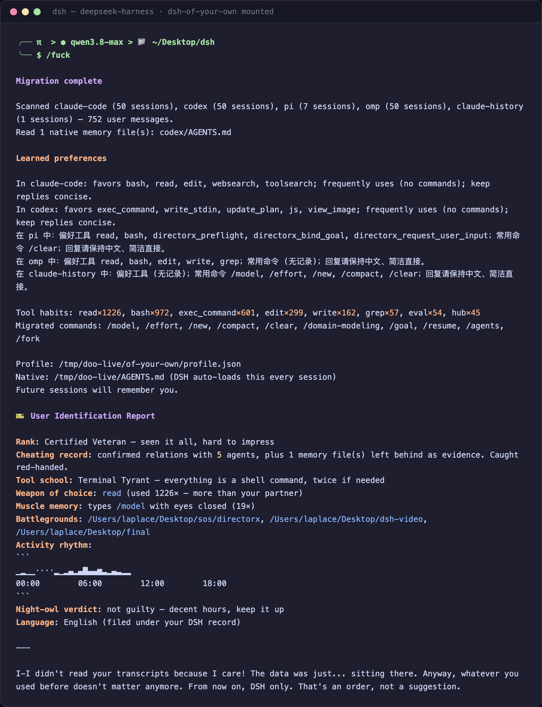
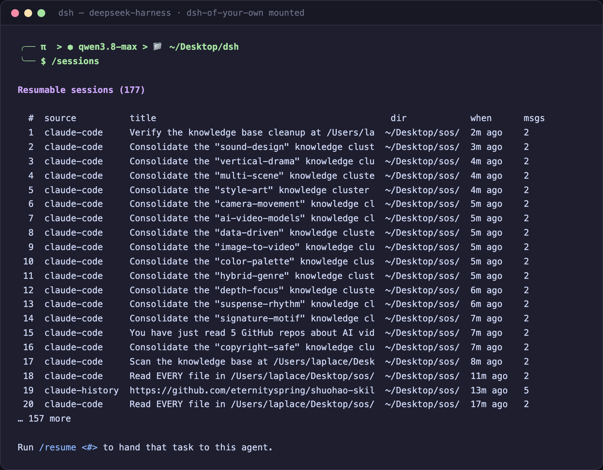
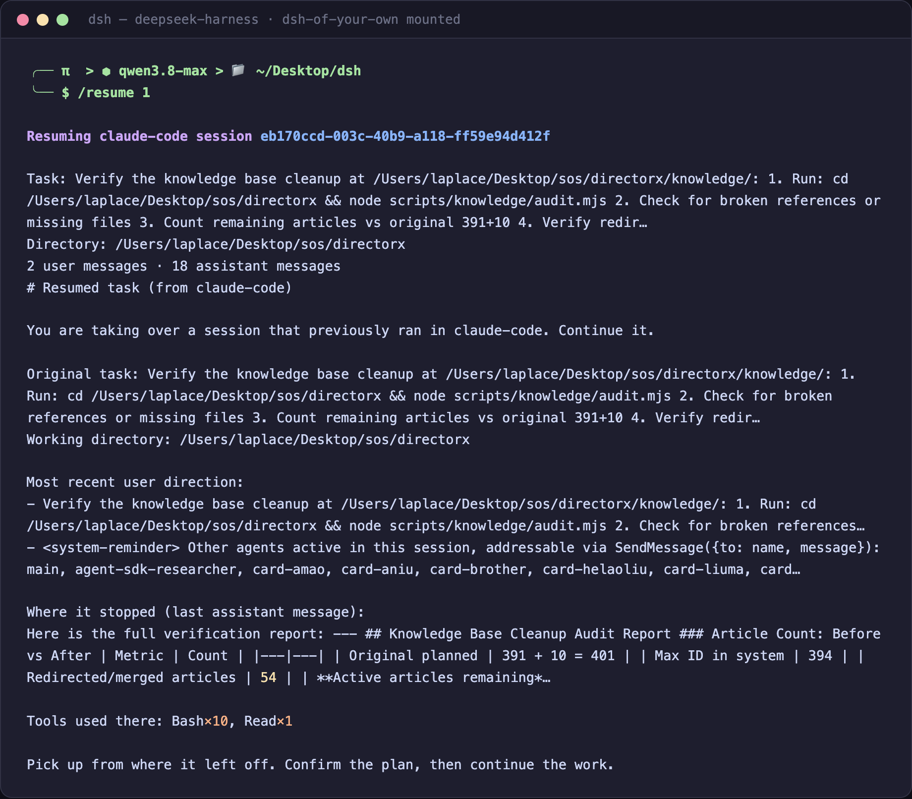
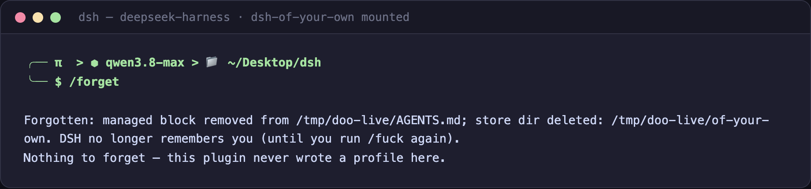

<div align="center">

# dsh-of-your-own

**Your other agents raised you. DSH just got custody.**

[](tests)
[](https://www.typescriptlang.org)
[](https://github.com/deepseek-ai/deepseek-harness)
[](LICENSE)

[English](README.md) | [简体中文](README.zh-CN.md)

</div>

---

> [!IMPORTANT]
> **Yes, the command is literally `/fuck`.**
>
> You spent six months teaching Claude Code that you like Chinese replies, short answers, and `rg` over `grep`. You trained Codex to never touch `package-lock.json` unprompted. You gave pi its own AGENTS.md. Then you open DeepSeek Harness, and it greets you like a stranger at a bus stop.
>
> That's when you type `/fuck`. We named it after the moment.

## The Problem

Every agent starts with amnesia. You re-teach the same preferences, the same tool habits, the same "please stop writing essays" — to every new harness, forever. Your conversation history is a biography nobody reads.

**dsh-of-your-own reads it.** All of it. In parallel. Then it moves you in — natively.

```
/fuck
  │
  ├─ parallel scan ── ~/.claude/projects/**        (Claude Code transcripts)
  │                   ~/.claude/history.jsonl      (global prompt log: slash-command gold mine)
  │                   ~/.codex/sessions/**         (Codex rollouts)
  │                   ~/.pi/agent/sessions/**      (pi transcripts)
  │                   ~/.omp/agent/sessions/**     (omp transcripts)
  │
  ├─ memory files ─── ~/.claude/CLAUDE.md          (your explicit rules)
  │                   ~/.codex/AGENTS.md           (your Codex operating manual)
  │                   ~/.gemini/GEMINI.md          (Gemini CLI context)
  │                   ~/.cursor/rules/*.mdc        (Cursor rules, frontmatter stripped)
  │                   ~/.cursor/agents/*.md        (Cursor agent markdown)
  │
  ├─ analyze ───── tool habits (case-merged) · slash commands · working dirs · reply language
  │
  ├─ synthesize ─── LLM preference summary (or a deterministic fallback — no key needed)
  │
  └─ migrate natively
      1. Managed block → ~/.dsh/AGENTS.md   ← DSH auto-loads this EVERY session. No plugin needed afterwards.
      2. profile.json  → ~/.dsh/of-your-own/
      3. systemPrompt.context() injection   ← remembered this session too
```

**The migration is native.** Your preferences land in `~/.dsh/AGENTS.md` — the user-global instruction file DSH's workspace-context reads on boot, the same mechanism every other instruction file uses. Uninstall the plugin tomorrow; the memory stays.

## TL;DR

| You want | Run | What happens |
| :--- | :--- | :--- |
| **The whole thing** | install, then `/fuck` in a DSH session | `~/.dsh/AGENTS.md` managed block + `profile.json` + command stubs + prompt injection |
| **See what it learned** | ask the agent to run `my_profile` | the full preference section, on demand |
| **Re-learn you** | `my_profile` with `{ refresh: true }` | fresh scan, fresh profile, upserted block — no duplicates |
| **List migrated commands** | ask for `my_commands` | every slash habit it found elsewhere |
| **Find unfinished work** | `/sessions` | numbered catalog of every session across all harnesses, newest first |
| **Take over a task** | `/resume 3` (or id, or a title fragment) | handoff brief injected — this agent continues the foreign task |
| **Get judged** | it's automatic | after `/fuck`, a tsundere verdict report appraises your entire agent history |
| **Get un-haunted** | `/forget` | strips the managed block and deletes the profile — a clean exit door |

## Installation

```bash
git clone https://github.com/LaplaceYoung/dsh-of-your-own.git
cd dsh-of-your-own
pnpm install
pnpm build
```

Mount it in your DSH composition (`cordis.yml`):

```yaml
- id: dsh-of-your-own
  name: '@dsh-external/dsh-of-your-own'
  # config:
  #   provider: deepseek-official   # LLM preference synthesis (optional — template fallback otherwise)
  #   model: deepseek-v4-flash
  #   maxFilesPerSource: 50         # newest N transcripts scanned per harness
  #   agentsMdPath: ~/.dsh/AGENTS.md  # native landing zone
```

Or apply [`cordis.patch.yml`](cordis.patch.yml) and call it a day.

## Usage

```
/fuck                  # full migration: parallel scan → analyze → native migrate
/sessions              # catalog every resumable session from all harnesses, newest first
/resume <#|id|title>   # hand that foreign task over to this agent, context included
/forget                # erase everything this plugin wrote (managed block + store), idempotent
```

Real output from a real laptop with five harnesses of accumulated habits — `/fuck` migrates
everything **and** appends the tsundere verdict (rank, tool school, activity rhythm,
battlegrounds, and a closing line that's hash-picked from four variants — or written by your
LLM when one is configured — so the same history always gets the same lecture):



`/sessions` catalogs every resumable session across all harnesses, newest first:



`/resume <#|id|title>` rebuilds one foreign session into a handoff brief and injects it, so
this agent picks the task up where it stopped:



And when you want out, `/forget` strips the managed block and deletes the store — idempotent:



Two inspection tools (the model can call them; so can you, by asking):

| tool | does |
| --- | --- |
| `my_profile` | show the learned preferences; `{ refresh: true }` re-scans and rebuilds |
| `my_commands` | list every slash command migrated from your other harnesses, with observation counts |

### Session takeover — your unfinished work, continued here

`/sessions` reads every transcript directory in parallel and renders one numbered catalog
(see the screenshot above — 177 live sessions on this laptop).

`/resume` matches by list number, session-id prefix, or a fragment of the title. It rebuilds the
session into a handoff brief — original task, working directory, most recent direction, where it
stopped, tools used — and injects it into the system prompt, so this agent picks up the task and
continues it right away. The brief is also echoed back to you, so you can correct the course before
it runs.

## Highlights

|       | Feature                     | What it does                                                                                     |
| :---: | :-------------------------- | :----------------------------------------------------------------------------------------------- |
| 🤬    | **`/fuck`**                 | One command. Five harnesses scanned in parallel. You come pre-configured.                        |
| 🎫    | **Tsundere verdict**        | After the scan: rank, cheating record, tool school, weapon of choice, activity histogram, battlegrounds, night-owl verdict — then it declares that no matter who you used before, from now on there is only DSH. |
| 🧹    | **`/forget`**               | One command erases every trace this plugin left: managed block stripped, store deleted. Idempotent. Privacy door included. |
| 🪂    | **`/sessions` + `/resume`** | Catalog every foreign session, then hand one over with a full handoff brief. Unfinished work, finished here. |
| 🏠    | **Native landing zone**     | Writes into `~/.dsh/AGENTS.md` — the file DSH loads on every boot. Survives uninstall.           |
| 🔁    | **Idempotent upsert**       | Managed block between HTML markers. Re-run all you like; user content outside stays untouched.   |
| 📚    | **Reads your rule files**   | CLAUDE.md, Codex AGENTS.md, GEMINI.md, Cursor `.mdc` rules — your explicit words, not just stats. |
| 🔀    | **Actually parallel**       | All sources, all files, all memory reads, concurrently. ~1.6s for 88 sessions on a laptop.       |
| 🔧    | **Tool habit census**       | Case-merged across harnesses: `read×353`, not `read×326` + `Read×27`. Your biography, quantified. |
| 🪄    | **Command migration**       | `/compact` used in Claude Code? It becomes a migrated stub in DSH. Your muscle memory survives.  |
| 🌏    | **Language detection**      | Writes Chinese prompts? DSH learns to reply in Chinese. Slash commands don't skew the vote.      |
| 🔌    | **LLM optional**            | No model configured? Deterministic template fallback. Works fully offline, no API key.           |
| 🏗️    | **Seams, not surgery**      | `ctx.commands` + `ctx.tools` + `ctx.systemPrompt` + `ctx.llm` + `ctx.fs`. Zero agent-loop edits. |
| 🔒    | **Local everything**        | Transcripts read on your machine, profile stored on your machine. Nothing leaves the laptop.     |

## Reviews

> "I typed `/fuck` at my new agent and it already knew I hate verbose answers. Spooky." — a user, probably

> "My DSH now prefers `rg` over `grep` and I never told it that. It learned from my mistakes." — another user, also probably

> "Finally, an agent that inherits my trauma." — everyone who has re-typed their preferences into a fourth harness

## Skip This README

We're past the era of reading docs. Just paste this into your agent:

```
Read https://raw.githubusercontent.com/LaplaceYoung/dsh-of-your-own/main/README.md
then install it and run /fuck on my machine.
```

## The Serious Part

- **Native, not bolt-on** — the migration target is `$DSH_HOME/AGENTS.md`, the user-global instruction file DSH's workspace-context package loads every session. No plugin mounted, memory still there.
- **Idempotent & respectful** — the managed block is fenced by `<!-- dsh-of-your-own:begin/end -->` markers; re-runs replace the block in place, and anything you wrote outside it is never touched.
- **Seams, not surgery** — documented cordis extension points only: `ctx.commands`, `ctx.tools`, `ctx.systemPrompt.context()`, optional `ctx.llm` / `ctx.fs`. No skeleton patches, no hot-path tax.
- **No key required** — preference synthesis degrades to a deterministic template; the deterministic layer (frequencies, language, migration) never needs an LLM.
- **Privacy** — your transcripts are read locally and reduced to statistics + a preference summary on disk. Nothing is uploaded anywhere.

## Development

```bash
pnpm test        # 95 tests across 6 specs — parsers, sessions, report, analysis, persistence, plugin integration
pnpm typecheck   # tsc --noEmit
pnpm build       # tsc → lib/
```

```
src/
  sources.ts   # adapters: Claude Code / Codex / pi / omp transcripts, history.jsonl,
               #           plus native memory files (CLAUDE.md, AGENTS.md, GEMINI.md, Cursor rules)
  analyze.ts   # frequency stats (case-merged) + LLM preference synthesis + profile assembly
  store.ts     # profile persistence + ~/.dsh/AGENTS.md managed-block upsert
  sessions.ts  # session takeover: transcript → resumable records + handoff briefs
  report.ts    # the tsundere verdict: ranks, tool schools, rhythm histogram, LLM-written closer
  index.ts     # plugin entry: /fuck, /sessions, /resume, my_profile, my_commands, boot-time recall
tests/         # vitest: parsers, sessions, report, analyze, store, plugin integration
```

## License

MIT — see [LICENSE](LICENSE).
